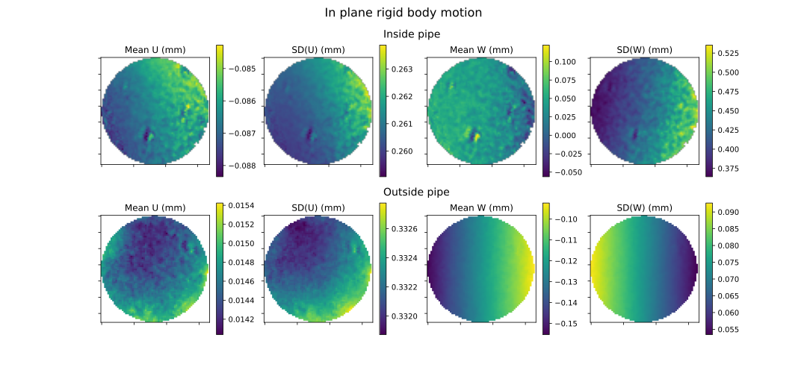

# Cryo-magnetic Probe Mock-up Work

## Summary of work undertaken
- 2D stereo setup used to test the light strength and suitability of the lenses.
- Stereo setup tested to see the suitability of a two camera stereo system and optimal camera and lighting placement was tested.
- 24 MPx cameras used to increase resolution, but hard to calibrate due to larger FOV.
- Correlation based optimisation investigated to improve out-of-plane measurements.
- Images taken down the mock-up with a stereo angle of 5 deg and images with an optimal stereo angle of 20 deg were compared.
- Setup simulated using Blender to evaluate uncertainty in the setup.

## Stereo Setup
Although having a stereo DIC setup is possible for this testing, it poses many challenges.
Most of the challenges were due to the constrained optical access present in the setup.
This impacted the lighting, lens choice and possible stereo angle.

The lighting in this setup was challenging since a powerful light source was required to illuminate the sample located ~1.4 m away.
It was decided to use a ring light to avoid shadows from the cameras.
This lighting then introduced another challenge: reflections from the probe itself.
In order to combat the effect of these reflections, polariser film was placed in front of the light and polarising filters were attatched to the lenses.
These polarisers greatly improved the quality of the images taken, and allowed them to be correlated through MatchID.
Another issue with the lighting was the difficulty in producing images where no part of the sample was over-exposed or in shadow.
This was possible with a smaller stereo angle between the cameras, but as the angle between the cameras increased this became a challenge and meant that MatchID struggled to correlate the images.
Even the images that were able to be correlated still had poor lighting, and could be improved by increased contrast in the speckle pattern. Therefore it would be good to investigate different lighting options.

The most challenging aspect of the setup was the positioning of the cameras.
Due to the long distance to the sample and the small diameter of the probe, the cameras had to be positioned fairly close to one another.
This meant that only a small stereo angle could be acheived.
This positioning constraint also impacted the choice of lenses to use.
Normally, high focal length macro lenses could be used for these scenarios with large stand-off distances.
However, since these macro lenses are considerably larger they could not be used for this application.
The size of lens was also a constraint of the stereo angle.

With the challenging camera setup came a challenging calibration.
Due to the fact that both cameras were looking down the probe and the end of the probe only took up a portion of their FOV, calibrating was not optimal.
Calibration images representative of the entire FOV could not be produced due to the optical setup.
This meant that the calibration parameters procuced from these calibration images are likely to not be fully accurate of reality.
Ways to try and mitigate this will be discussed below.

In order to mitigate the issues mentioned above, 100 mm fixed focal length lenses were used.
These were tested with both 24 MPx and 5 MPx cameras.
Since the 100 mm lenses are wider than the 75 mm lenses, they had to be moved further back to get an adequate stereo angle.
Due to the increased stand-off distance the setup with the 24 MPx cameras was difficult to calibrate, as the speckled area only made up around a third of the FOV.

## DIC Processing
### Correlation-based Optimisation
MatchID's correlation-based optimisation calibration method was tested on both experimental and Blender-rendered images.
This module can now input multiple stereo image pairs and minimise the epipolar distance to calculate a new set of calibration parameters.
There are three options for which calibration parameters to optimise:
- Extrinsics
- Extrinsics and intrinsics (exluding distortion)
- Extrinsics and intrinsics (including distortion)

The impact of all the options on the calibration parameters were investigated.
Generally, the intrinsic parameters did not change significantly, even when optimised.
Also when both intrinsic and extrinsic parameters were optimised, the extrinsic parameters did not change as significantly as when only the extrinsic parameters were optimised.

For all the sets of images tested, the stereo angle increased when the parameters were optimised.
This optimised calibration process has a positive impact on the processing of the DIC images.
Using the optimised calibration parameters lowers both the systematic and random error for both out-of-plane movement and epipolar distance.
The level of error for in-plane movement is increased, but ideal this error should be low enough that an increase will not be significant.
Both static and deforming/rigid body motion images can be utilised to optimise the calibration.

_Error maps comparing the impact of using correlation-based optimisation for static images_

_Error maps comparing the impact of using correlation-based optimisation for rigid body motion images_

### Image averaging
The impact of using image averaging on the noisefloor was investigated using a set of static images.
As can be seen below, image averaging improved the noisefloor so should be used for subsequent analysis.

### DIC Params

## Impact of Stereo Angle
The impact of the non-optimal stereo angle and reflections from the pipe were investigated.
This was done by comparing two setups:
- Imaging down the mock-up with a stereo angle of ~5 deg
- Imaging the sample at the same distance with an optimal stereo angle of ~20 deg

For each scenario, static and rigid body motion (both in and out of plane) images were taken.
For the rigid body motion images, the DIC calculated displacement was compared to the imposed displacement to obtain the error in the measurements.

This study showed the level of error present in the system associated with the cameras and lenses, not due to the reflection, lighting and stereo angle effects.

_Error maps for the in plane rigid body motion images_

_Error maps for the out of plane rigid body motion images_

_Error maps for static images_

## Level of systematic and random error in the setup
### Static images
The error maps below show the systematic and random error for both in plane and out of plane displacement.
Two sets of static images were taken, so the results for both sets of images is shown.

### Rigid body motion
Rigid body motion was carried out both in and out of plane to characterise the level of undertainty in the DIC measurements.
The difference between the imposed and calculated displacement was analysed.

### 100 mm lenses setup
The 100 mm lenses were tested with both 5 MPx cameras and 25 MPx cameras.
Since the 100 mm lenses are wider than the 75 mm lenses, the cameras had to be moved further away from the sample to allow for both cameras to have a view of the sample.
This increased stand-off distance meant that the speckled area still only covered a small amount of the FOV of the 24 MPx camera.

The temporal noise in static images for both the 5 MPx and 24 MPx cameras with 100 mm lenses can be seen below:

_Error map showing the temporal noise for static images for both 5 MPx and 24 MPx cameras with 100 mm lenses_

## Comparison to Blender images
The setup was also simulated using Blender to investigate different experimental setups.
Through Blender it was seen that a face-on stereo would not be realistic due to the contrained optical access, so a symmetric approach was opted for instead.
Calibration and rigid body motion images rendered in Blender were also run through MatchID to assess the level of error present only due to the limited stereo angle.

It was found that the stereo angle calculated from the calibration images was lower than that of the system (3.53 deg compared to 5 deg).
Therefore, a level of systematic error will be present in the results due to the inaccurate calibration parameters.

## Recommended future work
### Impact of decrease in working distance
During testing, as the probe cools down it will contract. This will change the working distance between the sample and cameras.
This raises the question of whether the sample will remain in focus due to the camera's depth of field.
It may also be difficult to balance the depth of field and aperture, as lighting is also an issue in the setup.

### Testing of calibration procedure
One method of calibrating the setup would be to calibrate the setup ex-situ, and then utilise the correlation-based optimisation module.
This module will use speckled images to correct the extrinsic parameters due to any slight changes to the setup.
This method could be investigated through calibrating the system, moving the camera setup slightly and then correcting for the calibration parameters.

### Different lighting methods
One difficulty with the stereo setup was positioning the ring light.
It was challenging to mititage the effects of overexposure from the light with poor lighting on the sample.
Therefore, it may be useful to experiment with different lighting scenarios e.g. behind the cameras to see if this can mitigate this issues.

Stronger light - lower aperture - better depth of field (currently can only acheive aperture 4 with light)

### Longer focal length lenses
One issue with the setup was the challenges in calibration.
This is due to the fact that the area visible at the end of the tube (including the speckled area) only takes up around half of the FOV.
This means that calibration images taken are only representative of part of the FOV, and therefore the calibration parameters calculated are not hugely accurate.
One way to mitigate this would be to use lenses with a higher focal length to get higher magnification.
This may in practice be challenging as higher focal length lenses will be larger, which will impact the stereo angle that can be acheived between the cameras.

Higher res cams

